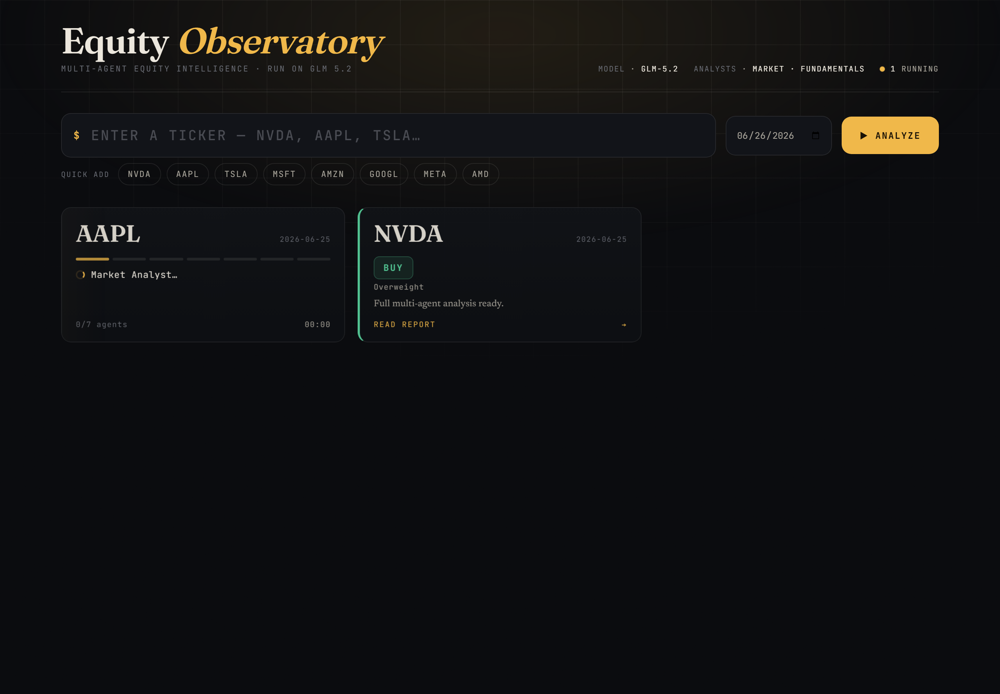

# 🤖 Multi-Agent Stock Analyst — powered by GLM 5.2

A config-driven runner that turns the open-source **[TradingAgents](https://github.com/TauricResearch/TradingAgents)** multi-agent framework into a one-command stock analyst, wired to run on **GLM 5.2** (Zhipu) and to export a clean **Markdown research report** for any NASDAQ/US ticker.

You give it a ticker; a team of LLM agents — technical analyst, fundamentals analyst, a **bull-vs-bear debate**, a trader, a risk committee, and a portfolio manager — research the stock and produce a sized **BUY / SELL / HOLD** decision with reasoning.

> ⚠️ **Research/educational only — not financial advice.** Outputs depend on the model, data, and date, and can be wrong.

---

## ✨ What this project adds

The multi-agent *framework* is [TradingAgents](https://github.com/TauricResearch/TradingAgents) (by Tauric Research). **This repo is the integration + UX layer on top of it:**

- 🖥️ **Local web dashboard** ("Equity Observatory") — add tickers, watch **live per-agent progress** on each tile, and click into a clean report view. Results are **cached locally** and persist across restarts.
- 🔌 **GLM 5.2 Coding Plan integration** — including the non-obvious fix that the Coding Plan uses a **different endpoint** (`/api/coding/paas/v4/`) than the standard pay-as-you-go API (which returns a balance error).
- ⚙️ **`config.json`-driven** — change ticker, date, analysts, model, and endpoint without touching code.
- 📄 **Markdown report export** — every agent's section saved to `reports/<TICKER>_<DATE>.md`.
- 🛡️ **Reliability fixes** — per-request timeout + retries (GLM can stall on the huge debate prompts), Windows UTF-8 handling, and a content-filter-safe default analyst set.

---

## 🖥️ The Dashboard

```bash
python server.py     # then open http://localhost:4400
```



- **Add a ticker** (or click a quick-add chip) → a tile appears and the agent team starts working.
- **Live progress** — each running tile shows the current agent (Market → Fundamentals → Bull/Bear debate → Trader → Risk → Portfolio Manager), a progress stepper, and an elapsed timer.
- **Run several at once** — tickers queue and process across worker threads (`config.json → dashboard.max_workers`).
- **Click a finished tile** → a clean, editorial **report view** (rendered from the markdown).
- **Cached locally** — finished analyses are saved to `reports/` and reappear as tiles when you restart the server. Remove a tile with the ✕.

---

## 🧠 How it works

```
            ┌──────────────┐   ┌──────────────────┐
 Ticker ──▶ │  Analyst Team │   │  Researcher Team │
            │  • Technical  │──▶│  🐂 Bull  vs  🐻 │──▶ Trader ──▶ Risk Committee ──▶ Portfolio
            │  • Fundamentals│  │  Bear  (debate)  │    (plan)   (🔥/🛡️/➖ debate)    Manager
            └──────────────┘   └──────────────────┘                                    │
                                                                                        ▼
                                                                        BUY / SELL / HOLD + entry/stop/size
```

Each agent is a separate GLM call (GLM 5.2 is a "thinking" model), so a full run takes a few minutes — that's the cost of the multi-agent debate.

---

## 📊 Sample output

See [`reports/`](reports/) for a full example report (technicals, fundamentals, bull/bear debate, risk review, and the final sized decision).

---

## 🚀 Setup

**Requirements:** Python 3.10+, a GLM (Zhipu) API key.

```bash
# 1. Clone
git clone https://github.com/praveenpke/tradingagents-glm.git
cd tradingagents-glm

# 2. Create a virtual environment
python -m venv .venv
# Windows:  .venv\Scripts\activate
# macOS/Linux:  source .venv/bin/activate

# 3. Install (pulls in the TradingAgents framework + its deps)
pip install -r requirements.txt

# 4. Add your GLM key
cp .env.example .env        # then edit .env and paste your key

# 5. (optional) edit config.json — ticker, date, model, etc.
```

## ▶️ Usage

```bash
# Uses config.json as-is:
python run_analysis.py

# Override the ticker (and optionally date / analysts) on the CLI:
python run_analysis.py AAPL
python run_analysis.py TSLA 2026-06-25
python run_analysis.py MSFT 2026-06-25 market,fundamentals
```

A report is written to `reports/<TICKER>_<DATE>.md` and the final decision is printed to the console.

> On Windows, prefix with `$env:PYTHONUTF8=1` (PowerShell) if you hit an encoding error.

---

## ⚙️ Configuration (`config.json`)

| Field | Example | Description |
|---|---|---|
| `ticker` | `"NVDA"` | Stock to analyze (any Yahoo-Finance ticker; US/NASDAQ need no suffix) |
| `date` | `"2026-06-25"` | "As-of" analysis date (a recent trading day) |
| `analysts` | `["market","fundamentals"]` | Which analysts to run: `market`, `fundamentals`, `news`, `social` |
| `llm.provider` | `"glm-cn"` | LLM provider id (`glm-cn` = GLM via BigModel; `glm` = via Z.AI) |
| `llm.deep_think_model` | `"glm-5.2"` | Model for heavy reasoning |
| `llm.quick_think_model` | `"glm-5.2"` | Model for quick sub-tasks (use a lighter model to speed up) |
| `llm.backend_url` | `.../api/coding/paas/v4/` | **Coding-Plan endpoint** (the key to avoid the balance error) |
| `max_debate_rounds` | `1` | Bull/bear debate rounds (more = slower, deeper) |
| `request_timeout_seconds` | `150` | Per-LLM-call timeout before retry |
| `max_retries` | `3` | Retries on a stalled/failed call |
| `output_dir` | `"reports"` | Where reports are saved |

Your **API key is never in `config.json`** — it stays in `.env` (gitignored).

### 💡 Notes
- **`news` / `social` analysts** can trip GLM's content filter on scraped headlines — the default keeps to `market` + `fundamentals` for reliability.
- **Other LLMs:** TradingAgents also supports OpenAI, Anthropic, Gemini, DeepSeek, Qwen, local Ollama, etc. — change `llm.provider`/models and the matching key in `.env`.

---

## 🛠️ Tech stack

Python · [TradingAgents](https://github.com/TauricResearch/TradingAgents) · LangGraph / LangChain · GLM 5.2 (Zhipu, OpenAI-compatible) · yfinance

## 🙏 Credits & license

- Multi-agent framework: **[TradingAgents](https://github.com/TauricResearch/TradingAgents)** by Tauric Research ([paper: arXiv:2412.20138](https://arxiv.org/abs/2412.20138)) — please review and respect its license.
- This integration/runner layer (`run_analysis.py`, `config.json`, reporting): MIT — see [LICENSE](LICENSE).
